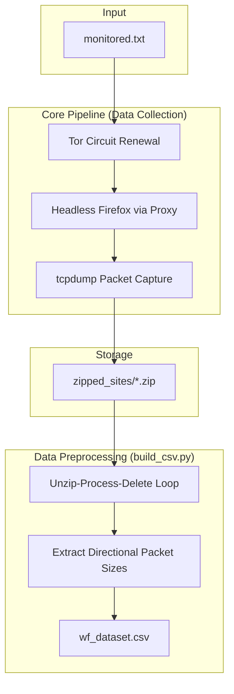

# RECREATE.md: Phase 1 (Data Collection & Preprocessing)

**Environment:** Ubuntu Linux VM (Recommended: 8GB RAM, 2+ CPU Cores) / Windows Host for Preprocessing

This document outlines the reproduction steps for automating Website Fingerprinting (WF) data collection over Tor and preprocessing the raw `.pcap` files into a machine-learning-ready structured CSV.

---

## 📊 Pipeline Overview

---

## 1. Environment Setup

Run your configuration script (`setup_env.sh`) to prepare the bare Ubuntu VM with the necessary system-level dependencies:
*   Installs Python packages, `tcpdump`, `tor`, and native `firefox` (via PPA to bypass Ubuntu Snaps).
*   Downloads and links `geckodriver` to `/usr/local/bin/`.
*   Configures `/etc/tor/torrc` (`ControlPort 9051`, `CookieAuthentication 1`).
*   Grants passwordless `sudo` rights specifically to `tcpdump` for silent captures.

---

## 2. Master Collection Script

**File:** `collect.py`

This script iterates through `monitored.txt` (a list of 50 URLs) to orchestrate automated traffic captures. For each trace, it:
1. Signals the Tor Control Port (9051) for a new identity (`NEWNYM`).
2. Starts a background `tcpdump` process listening on the active network interface.
3. Launches Firefox via Selenium, routed exclusively through Tor's proxy (`127.0.0.1:9050`).
4. Captures the traffic burst for 8–10 seconds, then safely tears down the browser and `tcpdump` processes.

*To run safely in the background for 20+ hours: `nohup python collect.py > collection_log.txt 2>&1 &`*

---

## 3. Preliminary ML Sanity Check

**File:** `test_model.py`

Validates pipeline integrity on a small batch of data before running the full collection. 
*   **Logic:** Uses Scapy to parse the first 1,500 packets per trace.
*   **Validation:** Feeds these arrays into a `RandomForestClassifier`. A successful capture pipeline will achieve ~75-80% baseline accuracy offline.

---

## 4. Turning PCAPs into a Mega CSV (Data Preprocessing)

**File:** `build_csv.py`

Machine Learning models cannot natively process 15+ GB of raw `.pcap` files. This script translates the network traffic into a lightweight, ML-ready Mega CSV dataset.

**Memory-Safe Processing:** 
To prevent disk crashes, the script uses an "Unzip-Process-Delete" loop:
1. Opens one site's `.zip` file.
2. Extracts the 100 `.pcap` files into a temporary folder.
3. Uses Scapy to extract the direction/size vectors, appending them as new rows to the CSV.
4. Immediately deletes the extracted `.pcap` files to free space before moving to the next zip.

### 🗄️ The CSV Schema (`wf_dataset.csv`)

The resulting CSV provides the "Raw Sequence" format, which gives the ML Engineer maximum flexibility to calculate Cumulative Sums (CUMUL) or feed the data directly into a Deep Learning CNN. 

The matrix is uniformly sized (5,000 rows × 1,501 columns):

| Column Name | Data Type | Description |
| :--- | :--- | :--- |
| **`website_label`** | **String** | The target variable ($y$). The target website name (e.g., `amazon`, `google`). |
| **`pkt_1`** | **Integer** | The directional size (in bytes) of the 1st packet captured. |
| **`pkt_2`** | **Integer** | The directional size (in bytes) of the 2nd packet captured. |
| ... | ... | ... |
| **`pkt_1500`** | **Integer** | The directional size (in bytes) of the 1,500th packet captured. |

**Important Schema Rules:**
1. **Directional Signs:** 
   * A **positive** number (e.g., `+512`) indicates an **Outgoing** packet (Client → Tor Node).
   * A **negative** number (e.g., `-1024`) indicates an **Incoming** packet (Tor Node → Client).
2. **Zero-Padding:** If a webpage trace finishes loading in fewer than 1,500 packets, the remaining columns are padded with `0`s to ensure the matrix remains perfectly rectangular.
3. **Truncation:** If a trace exceeds 1,500 packets, it is strictly truncated at `pkt_1500` to capture only the initial fingerprint burst and keep the dataset lightweight (~40 MB).