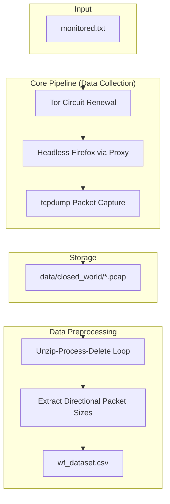

# WF-Guard: Phase 1 (Data Collection Pipeline)

**Environment:** Ubuntu Linux VM (Recommended: 8GB RAM, 2+ CPU Cores)

This project automates the collection of Website Fingerprinting (WF) data over the Tor network. It bypasses Ubuntu's strict Snap container restrictions, configures passwordless packet capture, and uses an isolated Python environment to orchestrate a Tor-routed headless browser.

---

## 📊 Pipeline Overview



---

## 1. Environment Setup

Run the configuration script (`setup_env.sh`) to prepare the bare Ubuntu VM with the necessary system-level dependencies:
*   Installs Python packages, `tcpdump`, `tor`, and native `firefox` (via PPA to bypass Snaps).
*   Downloads and links `geckodriver` to `/usr/local/bin/`.
*   Configures `/etc/tor/torrc` (`ControlPort 9051`, `CookieAuthentication 1`).
*   Grants passwordless `sudo` rights specifically to `tcpdump` for silent captures.

---

## 2. Master Collection Script (`collect.py`)

This script iterates through `monitored.txt` to orchestrate automated traffic captures. For each trace, it:
1. Signals the Tor Control Port (9051) for a new identity (`NEWNYM`).
2. Starts a background `tcpdump` process listening on the active network interface.
3. Launches Firefox via Selenium, routed exclusively through Tor's proxy (`127.0.0.1:9050`).
4. Captures the traffic burst for 8–10 seconds, then safely tears down the browser and `tcpdump` processes.

---

## 3. Preliminary ML Sanity Check (`test_model.py`)

Validates pipeline integrity on a small batch of data (e.g., 5 sites, 100 traces each) before running the full collection. 
*   **Logic:** Uses Scapy to parse the first 1,500 packets per trace. Assigns a positive (`+`) value to outgoing packet sizes and a negative (`-`) value to incoming packet sizes.
*   **Validation:** Feeds these arrays into a `RandomForestClassifier`. A successful capture pipeline will achieve ~75-80% baseline accuracy.

---

## 4. Execution & Operations Guide

### A. Define Target Websites
Create `monitored.txt` in your project folder and add your target URLs (one per line):
```text
https://www.google.com
https://www.amazon.com
https://www.wikipedia.org
... (50 total)
```

### B. Launching Background Collection
Full collection (5,000 traces) takes ~20+ hours. Use `nohup` to ensure the process survives SSH disconnects:
```bash
nohup python collect.py > collection_log.txt 2>&1 &
```
*   **Monitor Progress:** `tail -f collection_log.txt`
*   **Count Traces:** `ls -1 data/closed_world/ | wc -l`

> [!WARNING]
> **Manual Browsing:** Replacing the Firefox Snap container disables the standard Ubuntu Firefox desktop icon. Do not manually browse the web during collection to avoid network contamination. Use Chromium (`sudo apt install -y chromium-browser`) for manual tasks.

---

## 5. Turning PCAPs into a Mega CSV (`build_csv.py`)

Machine Learning models require structured datasets. This script translates 15+ GB of raw `.pcap` files into a lightweight, ML-ready Mega CSV.

*   **Target Format:** One row per trace. Column 1 is the `website_label`. Columns 2 to 1501 contain the sequential directional packet sizes (padded with `0`s if fewer than 1500 packets exist).
*   **Memory-Safe Processing:** Uses an "Unzip-Process-Delete" loop to prevent disk crashes:
    1. Opens one site's `.zip` file.
    2. Extracts `.pcap` files into a temporary folder.
    3. Uses Scapy to extract the direction/size vectors, appending them as new rows to `wf_dataset.csv`.
    4. Immediately deletes the extracted `.pcap` files to free space before moving to the next zip.
*   **Final Handoff:** Results in a highly condensed 30–50 MB `wf_dataset.csv` file, ready to be handed off to the ML Feature Engineer.