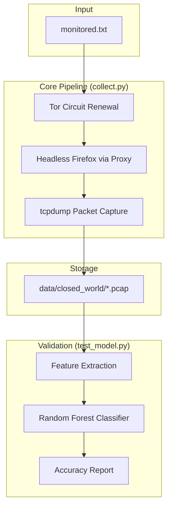

# WF-Guard: Phase 1 (Data Collection Pipeline)

**Environment:** Ubuntu Linux VM (Recommended: 8GB RAM, 2+ CPU Cores)

This project automates the collection of Website Fingerprinting (WF) data over the Tor network. It bypasses Ubuntu's strict Snap container restrictions, configures passwordless packet capture, and uses an isolated Python environment to orchestrate a Tor-routed headless browser.

---

## 📊 Pipeline Overview



---

## 1. Environment Setup

This script prepares your bare Ubuntu VM. It installs all dependencies, removes the restrictive Firefox Snap container, installs native Mozilla Firefox, configures Tor for Python-driven IP rotation, and sets up the project workspace.

### Setup Instructions
1. Open your terminal.
2. Run `nano setup_env.sh`.
3. Paste the following script:

```bash
#!/bin/bash
set -e

echo "=== [1/5] Installing System Dependencies ==="
sudo apt-get update -y
sudo apt-get install -y python3-pip python3-venv tcpdump tor wget tar nano software-properties-common zip

echo "=== [2/5] Fixing tcpdump Passwordless Sudo ==="
echo "$USER ALL=(ALL) NOPASSWD: /usr/bin/tcpdump, /usr/sbin/tcpdump" | sudo tee /etc/sudoers.d/tcpdump > /dev/null
sudo chmod 0440 /etc/sudoers.d/tcpdump

echo "=== [3/5] Swapping Snap Firefox for Native Firefox ==="
sudo snap remove firefox || true
sudo add-apt-repository ppa:mozillateam/ppa -y
echo -e "Package: *\nPin: release o=LP-PPA-mozillateam\nPin-Priority: 1001" | sudo tee /etc/apt/preferences.d/mozilla-firefox > /dev/null
sudo apt-get update -y
sudo apt-get install --allow-downgrades -y firefox

echo "=== [4/5] Installing Geckodriver & Configuring Tor ==="
wget -q https://github.com/mozilla/geckodriver/releases/download/v0.34.0/geckodriver-v0.34.0-linux64.tar.gz -O /tmp/geckodriver.tar.gz
sudo tar -xzf /tmp/geckodriver.tar.gz -C /usr/local/bin/
sudo chmod +x /usr/local/bin/geckodriver
rm /tmp/geckodriver.tar.gz

# Configure Tor Control Port
sudo sed -i '/ControlPort 9051/d' /etc/tor/torrc
sudo sed -i '/CookieAuthentication 1/d' /etc/tor/torrc
sudo sed -i '/CookieAuthFileGroupReadable 1/d' /etc/tor/torrc
echo -e "ControlPort 9051\nCookieAuthentication 1\nCookieAuthFileGroupReadable 1" | sudo tee -a /etc/tor/torrc > /dev/null
sudo systemctl restart tor
sudo usermod -aG debian-tor $USER
sleep 2
sudo chmod 644 /run/tor/control.authcookie || true

echo "=== [5/5] Creating Python Workspace ==="
mkdir -p ~/wf-guard/data/closed_world
cd ~/wf-guard
python3 -m venv venv
./venv/bin/pip install -q selenium stem scapy scikit-learn numpy

echo "✅ Environment Setup Complete! Please navigate to ~/wf-guard"
```

4. Save and run: `bash setup_env.sh`.

---

## 2. Master Collection Script (`collect.py`)

This script orchestrates the collection process by forcing new Tor circuits, managing `tcpdump` instances, and launching headless Firefox sessions to capture traffic bursts.

Create this file in `~/wf-guard/collect.py`:

```python
import os
import time
import subprocess
from selenium import webdriver
from selenium.webdriver.firefox.options import Options
from selenium.webdriver.firefox.service import Service
from stem import Signal
from stem.control import Controller

# --- CONFIGURATION ---
# IMPORTANT: Run `ip a` in terminal to verify your interface (e.g., eth0, ens33)
NETWORK_INTERFACE = "eth0" 
PCAP_SAVE_DIR = "data/closed_world/"
NUM_TRACES_PER_SITE = 100
CAPTURE_DURATION = 10 # Seconds to wait after initial connection

os.makedirs(PCAP_SAVE_DIR, exist_ok=True)

def renew_tor_circuit():
    """Forces Tor to build a brand new circuit for a clean trace."""
    try:
        with Controller.from_port(port=9051) as controller:
            controller.authenticate()
            controller.signal(Signal.NEWNYM)
            time.sleep(3) 
    except Exception as e:
        print(f"  [!] Tor Circuit warning: {e}")

def setup_browser():
    """Configures Firefox to run invisibly and route through Tor."""
    options = Options()
    options.add_argument('-headless')
    options.page_load_strategy = 'eager' # Speed optimization
    
    # Route through local Tor proxy
    options.set_preference('network.proxy.type', 1)
    options.set_preference('network.proxy.socks', '127.0.0.1')
    options.set_preference('network.proxy.socks_port', 9050)
    options.set_preference('network.proxy.socks_remote_dns', True)
    
    # CRITICAL: Prevent Tor from breaking Geckodriver's internal connection
    options.set_preference('network.proxy.no_proxies_on', 'localhost, 127.0.0.1')
    
    # Disable cache for clean captures
    options.set_preference("browser.cache.disk.enable", False)
    options.set_preference("browser.cache.memory.enable", False)
    options.set_preference("network.http.use-cache", False)
    
    service = Service("/usr/local/bin/geckodriver")
    driver = webdriver.Firefox(service=service, options=options)
    driver.set_page_load_timeout(15) 
    return driver

def main():
    if not os.path.exists("monitored.txt"):
        print("Error: monitored.txt not found. Create it with your target URLs.")
        return

    with open("monitored.txt", "r") as f:
        sites = [line.strip() for line in f if line.strip()]

    for site in sites:
        site_name = site.replace("https://www.", "").replace("https://", "").split(".")[0]
        print(f"\n=== Starting collection for {site_name} ===")
        
        for i in range(NUM_TRACES_PER_SITE):
            pcap_file = os.path.join(PCAP_SAVE_DIR, f"{site_name}_{i}.pcap")
            print(f"[{i+1}/{NUM_TRACES_PER_SITE}] Capturing {site}...")
            
            renew_tor_circuit()
            
            cmd =["sudo", "tcpdump", "-i", NETWORK_INTERFACE, "-w", pcap_file, "tcp", "-q"]
            capture_proc = subprocess.Popen(cmd, stdout=subprocess.DEVNULL, stderr=subprocess.DEVNULL)
            time.sleep(1) 
            
            driver = setup_browser()
            try:
                driver.get(site)
                time.sleep(CAPTURE_DURATION)
            except Exception:
                pass # Silently proceed if page load times out or finishes early
            finally:
                driver.quit()
                capture_proc.terminate()
                capture_proc.wait()
                time.sleep(1) 

if __name__ == "__main__":
    main()
```

---

## 3. Preliminary ML Sanity Check (`test_model.py`)

Run this on a small batch of data (e.g., 5 sites, 100 traces each) to verify the pipeline. This basic Random Forest classifier achieves ~75-80% accuracy by analyzing packet sizes and sequences.

Create this file in `~/wf-guard/test_model.py`:

```python
import os
import numpy as np
from scapy.all import rdpcap, IP
from sklearn.ensemble import RandomForestClassifier
from sklearn.model_selection import train_test_split
from sklearn.metrics import accuracy_score

PCAP_DIR = "data/closed_world/"
MAX_PACKETS = 1500 

def extract_features(pcap_path):
    try:
        packets = rdpcap(pcap_path)
    except Exception: return None
    if len(packets) < 10: return None

    try: client_ip = packets[0][IP].src
    except IndexError: return None 

    seq_features =[]
    total_in = 0
    total_out = 0

    for p in packets:
        if IP in p:
            size = p[IP].len
            if p[IP].src == client_ip:
                seq_features.append(size)
                total_out += size
            else:
                seq_features.append(-size)
                total_in += size
        if len(seq_features) >= MAX_PACKETS: break

    if len(seq_features) < MAX_PACKETS:
        seq_features.extend([0] * (MAX_PACKETS - len(seq_features)))

    return[len(packets), total_in, total_out] + seq_features

def main():
    X, y = [],[]
    for filename in os.listdir(PCAP_DIR):
        if not filename.endswith(".pcap"): continue
        filepath = os.path.join(PCAP_DIR, filename)
        features = extract_features(filepath)
        if features is not None:
            X.append(features)
            y.append(filename.split('_')[0])

    if not X: return print("Error: No pcaps found.")
    
    X_train, X_test, y_train, y_test = train_test_split(X, y, test_size=0.2, random_state=42)
    clf = RandomForestClassifier(n_estimators=150, max_depth=20, random_state=42)
    clf.fit(X_train, y_train)
    
    print(f"\n✅ PRELIMINARY ACCURACY: {accuracy_score(y_test, clf.predict(X_test)) * 100:.2f}%")

if __name__ == "__main__":
    main()
```

---

## 4. Execution & Operations Guide

### A. Define Target Websites
Create `monitored.txt` in `~/wf-guard` and add your target URLs (one per line):

```text
https://www.google.com
https://www.amazon.com
https://www.wikipedia.org
```

### B. Launching Background Collection
Since full collection (e.g., 5,000 traces) can take 20+ hours, use `nohup` to ensure the process continues after SSH disconnects.

**Run this command:**
```bash
cd ~/wf-guard
nohup ./venv/bin/python collect.py > collection_log.txt 2>&1 &
```

*   **Monitor Progress:** `tail -f collection_log.txt`
*   **Count Collected Traces:** `ls -1 data/closed_world/ | wc -l`

> [!WARNING]
> **Manual Browsing:** Replacing the Firefox Snap container disables the standard Ubuntu Firefox desktop icon. Do not manually browse the web during collection to avoid network contamination. Use Chromium (`sudo apt install -y chromium-browser`) for manual tasks.

### C. Data Extraction
To move the dataset to your host machine:

1. **Zip the Dataset:**
   ```bash
   cd ~/wf-guard/data
   zip -r full_dataset.zip closed_world/
   ```

2. **Start File Server:**
   ```bash
   python3 -m http.server 8000
   ```

3. **Download:** Navigate to `http://[VM_IP_ADDRESS]:8000` on your host PC and click `full_dataset.zip`. Press `Ctrl+C` in the VM terminal to stop the server when finished.
